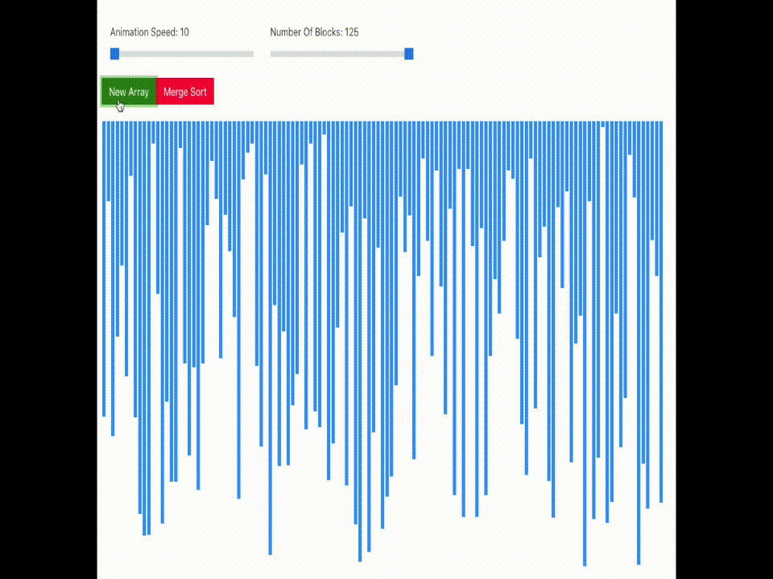
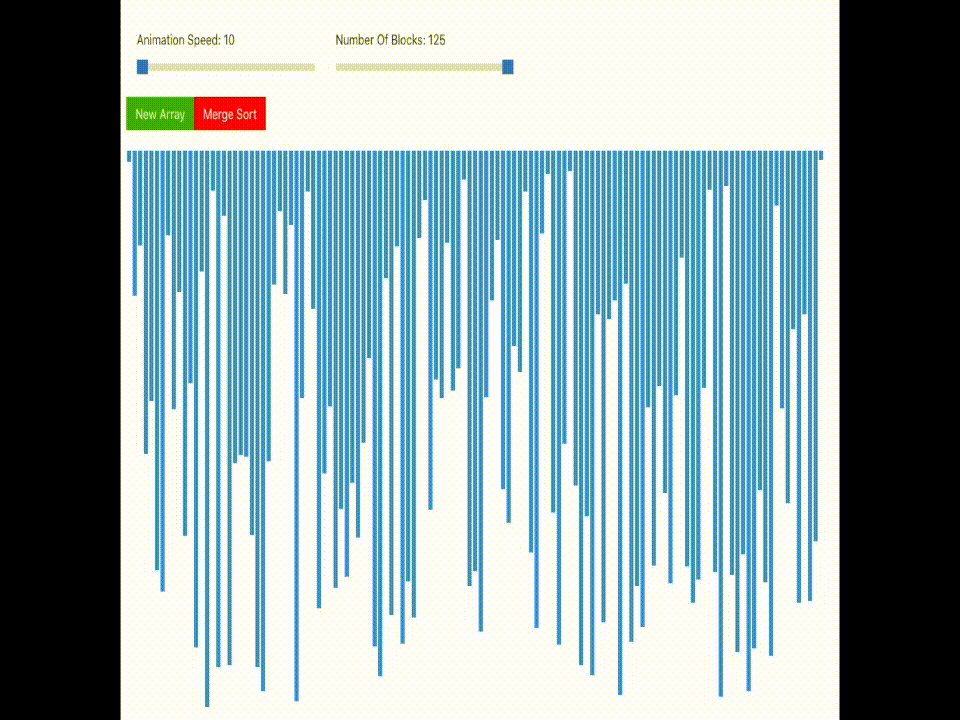

# Algorithm Visualizer

A React App that allows Algorithm Visualization

Live Version [here](https://algo-visuals.herokuapp.com/)

Algorithms:

- [x] Merge Sort
- [ ] Bubble Sort
- [ ] Quick Sort
- [ ] Insertion Sort

## Available Scripts

In the project directory, you can run:

### `yarn start`

Runs the app in the development mode. 
Open [http://localhost:3000](http://localhost:3000) to view it in the browser.
